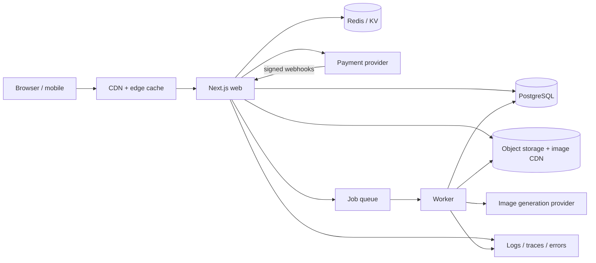

# UNSAID — Architecture

## Decision
Use a **modular monolith**: one Next.js storefront/application, one asynchronous worker boundary, shared TypeScript packages, managed PostgreSQL, object storage/CDN, and Redis only for ephemeral workloads. Do not start with microservices or Kubernetes.

## Public traffic path
1. Product and collection pages are server-rendered and cached at the CDN.
2. Product media are immutable CDN assets, never proxied from the application server on every request.
3. Search/filter queries use cursor pagination and PostgreSQL indexes. Do not render the whole catalog in the browser.
4. Checkout, account, inventory, and admin routes bypass public-page caching.

## Why this scales
Media and repeated catalog reads are served outside the application/database hot path. Web instances stay stateless and scale horizontally; PostgreSQL handles transactional state and cache misses.

## Boundaries
- `apps/web`: storefront, product/search, account/admin, checkout orchestration.
- `apps/worker`: render generation, transcodes, email, webhook retries.
- `packages/domain`: business types/invariants.
- `packages/db`: relational schema/migrations.
- `packages/catalog`: catalog/search contracts.
- `packages/ui`: UI primitives from `DESIGN.md`.

## Production reference
Web/CDN on Vercel or Cloudflare; managed PostgreSQL with connection pooling; S3-compatible object storage; managed Redis/KV; Stripe or Shopify; managed queue/job runner. Providers are adapters, not domain dependencies.
