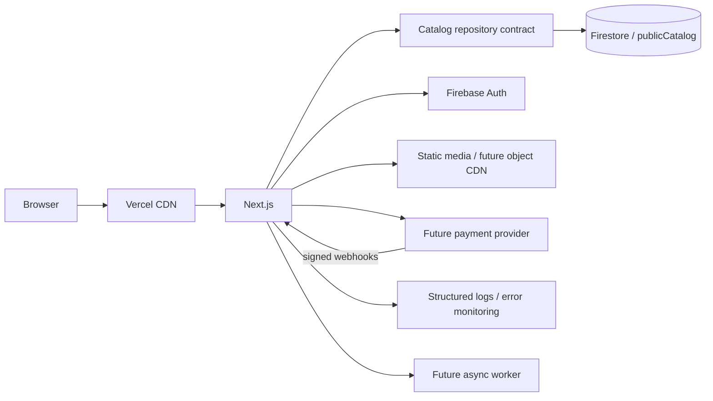

# UNSAID — Architecture

## Decision

UNSAID uses a **modular monolith**. The production application is one Next.js app on Vercel, with Firebase providing authentication and Firestore providing the current editorial data store.

Do not introduce PostgreSQL, Redis, microservices, Kubernetes, a dedicated search engine or an object-storage migration until a measured product requirement justifies them.



## Current production boundaries

### `apps/web`

Owns:

- public storefront;
- continuous archive;
- product pages;
- privacy/legal surfaces;
- authenticated admin UI;
- future customer account UI;
- future checkout orchestration.

Public routes are server-first. Client components are reserved for interaction that actually needs browser state.

### `packages/catalog`

Owns catalog contracts and the versioned local fallback archive.

The application consumes a `CatalogRepository` contract instead of depending on Firestore query details inside route components.

### `packages/db`

Owns the current Firestore adapter and trusted catalog persistence logic.

Firestore is an adapter, not a UI dependency. A future database migration must be possible by implementing the same repository contracts instead of rewriting the storefront.

### `packages/domain`

Owns business invariants that should survive provider changes:

- account/customer contracts;
- commerce policy;
- product/media contracts;
- orders/payments/inventory interfaces;
- MODEL 01 media identity.

### `apps/worker`

Reserved for asynchronous work such as render generation, transcodes, email and webhook retries. It must not be introduced into synchronous customer flows unless required.

## Product decisions locked in

- Catalog model: **continuous archive**, no drops/collections for now.
- Garments: phase one white/black.
- Customer checkout: **account required**.
- Initial sales market: **Italy only**.
- Currency: **EUR**.
- Public browsing remains available without an account.
- Commerce remains disabled until both feature and legal gates are enabled.

## Public traffic path

1. Browser requests a page from Vercel.
2. Cached public HTML/media is served at the edge where possible.
3. On an origin miss, Next.js calls the catalog repository.
4. The Firestore adapter performs bounded server-side reads.
5. Anonymous browsers never query Firestore directly.
6. The browser receives only the page of catalog data it needs.

## Customer account path

Firebase Authentication is the identity provider for customer accounts as well as admin authentication, but authorization is separate.

Customer-facing design:

1. create/sign in to Firebase Auth account;
2. server verifies identity before account/order operations;
3. customer profile is stored separately from authentication credentials;
4. checkout requires an authenticated customer;
5. shipping addresses are restricted to Italy in the commerce boundary;
6. orders snapshot the shipping/contact data used at purchase time.

A customer-controlled Firestore field must never determine admin privileges. Admin access continues to use the owner/admin allowlist.

See `docs/ACCOUNTS.md`.

## Commerce path

Editorial catalog and commerce state are deliberately separate.

```text
CatalogRecord
    |
    | catalogId
    v
SellableProduct
    |
    +--> SellableVariant / SKU
    +--> Inventory
    +--> OrderLine
            |
            v
          Order --> Payment --> Shipment
```

Price, stock, reservations, payment state and fulfillment must never become mutable fields that rewrite the creative identity of a shirt.

The current `priceCents` field in the editorial prototype is transitional. Before checkout is enabled, the sellable-product domain becomes the commercial source of truth.

See `docs/COMMERCE.md`.

## Caching

Current storefront pages use bounded server reads and time-based revalidation.

The next production step after admin mutations move server-side is on-demand invalidation using stable tags:

- `home`;
- `catalog`;
- `catalog:<sort>:<cursor>`;
- `product:<slug>`.

Admin, account, cart, checkout and order routes are dynamic/private and must not be cached as public content.

## Search

Do not implement full-text search by downloading the catalog into React.

When search becomes commercially useful, add a `CatalogSearch` adapter backed by a deliberately maintained index. Firestore remains the editorial source of truth; the search index is a rebuildable projection.

## Media

Current repository/Vercel-hosted product media is acceptable at the present scale.

The domain distinguishes:

- clean product front/back;
- detail;
- MODEL 01 editorial;
- campaign;
- video.

Move media to object storage/CDN only when repository size, derivative count, deployment time or video volume justify it. Media URLs must not become business identity keys; use stable asset IDs.

## Observability

The codebase includes a provider-neutral structured logging foundation. Production error monitoring can later be connected to Sentry or an equivalent service without changing domain code.

Every future checkout/order mutation should carry:

- request ID;
- customer ID where authenticated;
- order ID where available;
- idempotency key for payment-sensitive operations.

Never log passwords, auth tokens, card details or unnecessary personal data.

## What not to add yet

Do not add infrastructure because it looks scalable.

Specifically avoid for now:

- PostgreSQL migration;
- Redis/KV;
- microservices;
- Kubernetes;
- dedicated queue;
- dedicated search engine;
- customer-facing collection/drop model;
- multi-country tax/shipping logic.

Introduce them only when the real system produces a requirement the current architecture cannot satisfy cleanly.
